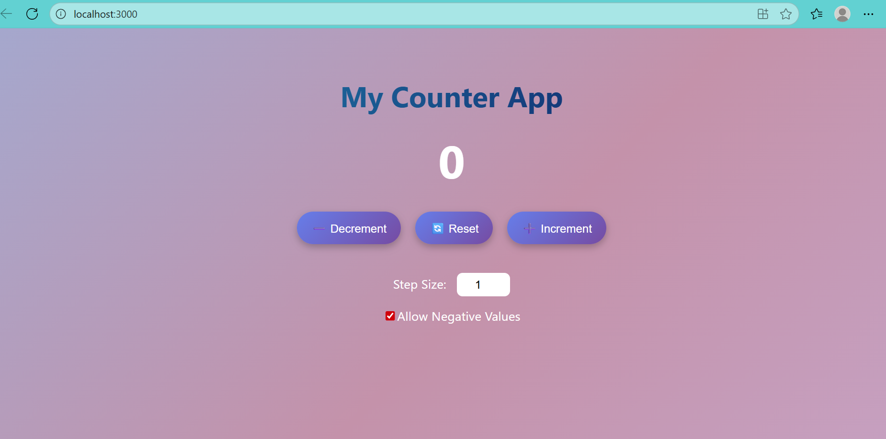

# My Counter App

A React-based counter app that lets users view, increment, decrement, or reset a value within set bounds. Inputs include a custom step size and an optional negative toggle, with buttons disabling at limits. 

## 🔗 Links
GitHub Repository Link : https://github.com/PratibhaPanda001/CounterAppByReact.git

## 🔗 Live Demo Link using Netlify
link : https://mycounterwithreact.netlify.app/
incase this link fails, i'd request please go through the mp4 vdo file

##   Tech Stack

- **React** (Hooks, Functional Components)  
- **JavaScript**, **HTML**, **CSS**  
- **localStorage** API for state persistence

## ⚙ How to Run Locally

**Prerequisites:**
- [Node.js](https://nodejs.org/) (v14+) and npm installed.

### Standard Workflow
1. git clone https://github.com/PratibhaPanda001/CounterAppByReact.git

2. cd CounterAppByReact
3. npm install
4. npm start

## Challengesm Faced and Solutions

Managing button disablement at bounds
Ensuring the increment and decrement buttons become disabled when reaching the configured upper or lower limit required careful state checks. I added conditional logic to toggle disabled status dynamically based on the counter value and updated it via React’s state and effects.

Implementing custom step size and negative toggle logic
Handling dynamic step sizing and the option to block negative values involved consolidating user input validation and toggle settings. I created controlled input components with useState, and applied checks inside the counter logic to ensure accurate, robust behavior.

Adding dynamic UI feedback with styling and transitions
To make interactions feel smooth and engaging, I applied CSS transitions and conditional styling based on state. This improved usability and visual clarity.

## Screenshots of the Application UI

##  Feature List

### Core Features
- **Display current counter value**
- **Increment, Decrement, and Reset** buttons for flexible control
- **Upper and Lower Bounds** to restrict counter within limits
- **Auto-disable buttons** when bounds are reached to prevent invalid actions
- **Custom step size input** allowing tailored increment/decrement functionality
- **Negative Value Toggle** to enable or disable negative counting

### Bonus Features
- **Dynamic CSS styling** based on state (e.g., color changes, disabled button visuals)
- **Smooth visual feedback** using transitions or animations for button interactions
- **State persistence with `localStorage`**, ensuring counter and settings survive page reloads

  
## Sample Input & Output 

### Increment Button Clicked
**Input:** User clicks the **Increment** button  
**Output:** The displayed counter value increases by the current step size. If the value reaches the maximum bound, the Increment button becomes disabled.

---

### Step Size Changed
**Input:** User changes the step size to a new number (e.g., 5)  
**Output:** Subsequent increments or decrements adjust the counter by the newly specified amount.

---

### Upper/Lower Bound Reached
**Input:** Counter hits the upper bound (e.g., 10) or lower bound (e.g., 0)  
**Output:** The corresponding button (Increment at upper bound, Decrement at lower bound) is disabled to prevent values outside the allowed range. If the negative toggle is off and the lower bound is 0, the counter won't go below zero.

